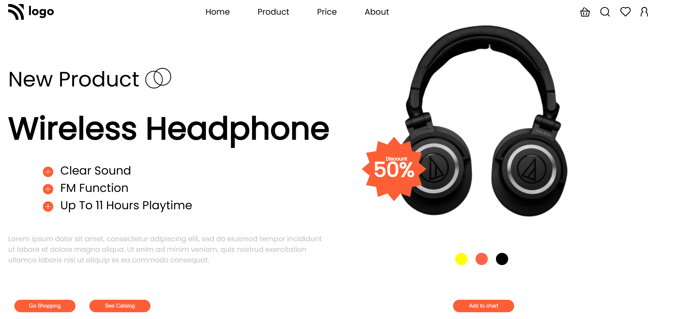
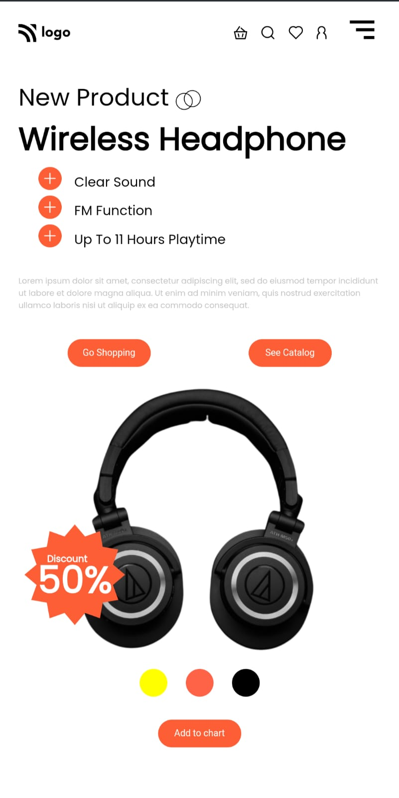

# 🎧 Product Home Page

This is a fully responsive product landing page showcasing a wireless headphone product. Designed to be visually appealing and user-friendly, it features smooth responsiveness and interactivity, suitable for all device sizes.

---

## 🌟 Features
- **Modern UI Design:** Clean and vibrant layout with engaging visuals.
- **Responsive Layout:** Optimized for mobile, tablet, and desktop views.
- **Dynamic Navbar:** Includes a hamburger menu for smaller screens.
- **Product Highlights:** Clear display of product features and benefits.
- **Interactive Buttons:** Call-to-action buttons for shopping and viewing the catalog.
- **Discount Display:** Prominent discount section for promotional purposes.

---

## 📖 Table of Contents
1. [Technologies Used](#technologies-used)
2. [Sections Overview](#sections-overview)
3. [How to Use](#how-to-use)
4. [Screenshots](#screenshots)
5. [Feedback](#feedback)

---

## 🛠️ Technologies Used
- **HTML5**: Semantic structure for the content.
- **CSS3**: Styling and responsive design.
- **JavaScript**: Interactivity and menu toggle functionality.
- **Boxicons**: For stylish and consistent icons.

---

## 📋 Sections Overview
### 1. **Navbar**
- Dynamic menu with active state highlighting.
- Hamburger menu toggles for smaller screens.

### 2. **Intro Section**
- Headphone product introduction with a focus on features like clear sound, FM function, and extended playtime.
- Downloadable product catalog.

### 3. **Discount Section**
- Highlights a promotional discount with eye-catching visuals.

### 4. **Responsive Design**
- Fully responsive with media queries ensuring optimal user experience across all devices.

---

## ⚙️ How to Use
1. Clone the repository:
   ```bash
   git clone git clone https://github.com/NitinTSutar/css-2-landing_page-.git
   ```
2. Navigate to the project folder:
   ```bash
   cd landing_page-
   ```
3. Open `index.html` in your browser to view the page.

---

## 🖼️ Screenshots
### Desktop View


### Mobile View


---

## 💬 Feedback
I’d love to hear your thoughts on this project! Feel free to reach out:
- **[GitHub](https://github.com/NitinTSutar)**
- **[Email](mailto:nitinsuthar67@gmail.com)**

If you encounter any issues or have suggestions, feel free to open an issue or submit a pull request. 😊
